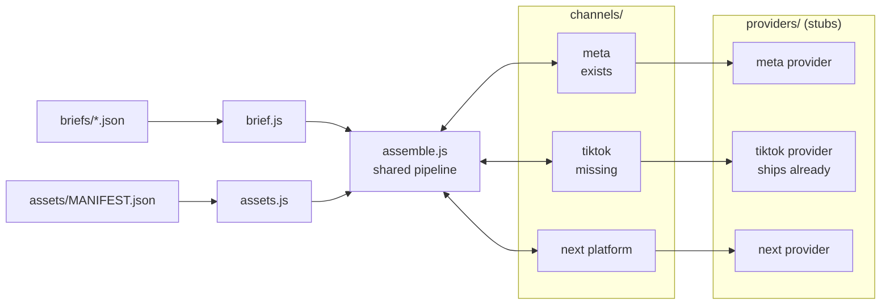
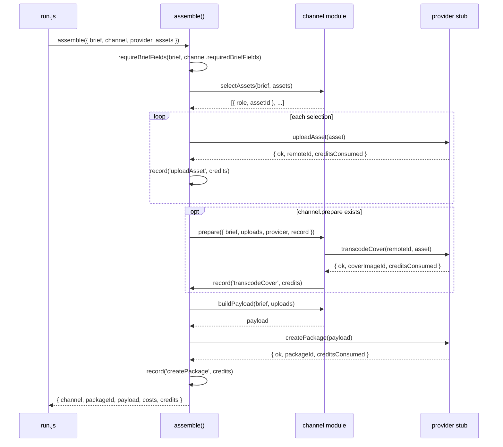

# Architecture

## What this service does

It turns a creative brief and a set of supplied assets into an advertising
package, and submits that package to one advertising channel. One run is one
brief, one channel, one package. The providers are stubs: they return canned
responses and report a simulated credit cost per call, and those credits are how
a run's cost is measured. One channel exists today, `meta`. This note is about
adding a second, `tiktok`.

## What is already present

`src/assemble.js` is one fixed pipeline that knows nothing about any particular
channel. It never branches on which channel it is running — it calls the same
members on whatever channel object it is handed, and adds up the credits every
provider call reports.

A channel is four things plus one optional thing, registered in
`src/channels/index.js`:

| Member | What it answers |
|---|---|
| `id` | Which provider this channel talks to. `assemble()` refuses a mismatch. |
| `requiredBriefFields` | Brief fields this channel cannot build without |
| `selectAssets` | Which of the brief's assets to upload, and what role each plays |
| `buildPayload` | The object this channel's provider expects |
| `prepare` (optional) | Provider calls the pipeline does not make on its own |

`src/channels/meta.js` is the one existing implementation, and it is the
reference for what a correct one looks like. Adding a platform means one new
module beside it and one line in the registry — `assemble.js`, `brief.js`,
`assets.js` and the existing channel are not touched. Each provider stub
enforces its own payload shape and limits independently (`PROVIDERS.md`), so
platform quirks — flat vs. nested, field names, length limits, which assets —
belong in the channel module, and the brief and asset manifest stay neutral.

The second channel is `tiktok`. Its provider stub ships complete; what is
missing is the channel module, its one line in `src/channels/index.js`, and a
`run:tiktok` script in `package.json`. It is a good test of the contract because
it needs things `meta` does not: two assets instead of one, and a `prepare` step.

## Data flow

1. **Brief check.** `briefId`, `campaignId` and `assetIds` are checked for every
   brief by `brief.js`. Anything beyond that is the channel's own declaration,
   checked before a single provider call is made.
2. **Upload.** `selectAssets` returns one entry per asset, each tagged with a
   role. `assemble()` uploads each and keys the results by role in `uploads`, so
   later steps address assets by meaning rather than array position.
3. **`prepare`.** tiktok's cover has to be transcoded before `createPackage`
   will take it, and the pipeline does not make that call, so it goes here and
   reports its own cost through `record`.
4. **Payload and create.** `buildPayload` returns exactly the keys the provider
   allows — every stub rejects unknown fields.

## What the tiktok channel fills in

| Payload field | Source |
|---|---|
| `channel` | the literal `'tiktok'` — the stub checks this before anything else |
| `advertiserId` | `brief.advertiserId` |
| `caption` | `brief.headline`, trimmed to 100 with the shared `truncate()` |
| `videoAssetId` | `remoteId` of the uploaded 9:16 mp4 |
| `coverImageId` | `coverImageId` from `transcodeCover`, not the upload's `remoteId` |
| `musicId` | `brief.musicId` |
| `landingPageUrl` | `brief.landingPageUrl` |

There is no `description` field on this channel, and the payload is flat
camelCase rather than meta's nested snake_case.

One wrinkle worth naming up front: `assemble()` calls `buildPayload(brief,
uploads)` with no third argument, so the `coverImageId` that `prepare` obtains
has to reach `buildPayload` some other way. `prepare` and `buildPayload` receive
the same `uploads` object, so the channel can attach it there — no change to
`assemble.js`. That constraint is not a preference: `test/assemble.test.js` and
`test/meta.channel.test.js` pin this contract and have to pass untouched.

Expected cost for one tiktok package: two uploads at 15, one transcode at 8, one
create at 3 — **41 credits**, against meta's 15. To be confirmed against what the
stub actually reports.

## Failure modes I expect

- **A brief missing a field tiktok needs.** The full list is `advertiserId`,
  `musicId`, `headline` and `landingPageUrl` — `brief.js` checks none of them.
  `headline` belongs on it because it is the caption source and `truncate()`
  throws a raw `TypeError` on a non-string, which would surface at
  `buildPayload` after both uploads are already paid for.
- **Picking the wrong cover.** `uploadAsset` checks an image's format but not
  its ratio, so a 16:9 jpg uploads happily for 15 credits and only fails at
  `transcodeCover` with `cover_must_be_square`, 8 credits later. The supplied
  brief contains exactly that asset (`still-16x9`), so `selectAssets` has to
  filter on `ratio === '1:1'` itself rather than rely on the provider.
- **A failed `transcodeCover` passing silently.** `assemble()` checks `ok` on
  the calls it makes itself, but it ignores whatever `prepare` returns. So
  `prepare` has to check `ok` and throw, or an undefined `coverImageId` reaches
  `createPackage` and the run dies there as `missing_field` instead.
- **A cover reaching `createPackage` without going through `transcodeCover`.**
  The stub tracks which ids it issued and rejects the rest (`cover_not_transcoded`),
  so `prepare` running before `buildPayload` is load-bearing.
- **A rejected call still costs, and nothing is rolled back.** `assemble()`
  records credits before it checks `ok`, and uploads run one after another with
  no cleanup — so a cover rejection leaves the video uploaded and charged. Both
  matter for the cost estimate.

## What I'd want clarified before building this for real

- **Where the caption comes from.** The brief carries copy written for meta
  (`primaryText`, `headline`, `description`). tiktok wants a caption of 100
  characters or fewer and has no description field at all. I am deriving it from
  `headline`; a real brief would carry its own tiktok copy rather than borrowing
  meta's.
- **Whether the cover is always the one square image.** The supplied brief has
  exactly one 1:1 asset, so "pick the square one" works here. A brief with two
  would need a rule for which one wins.
